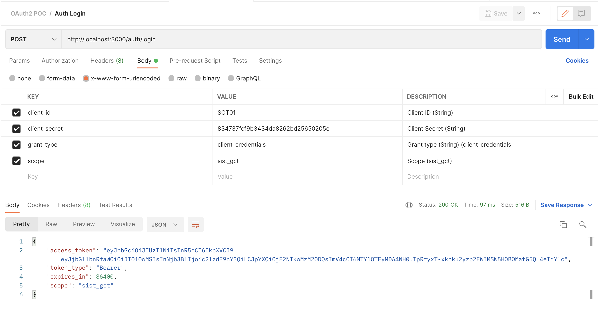

# OAuth2 POC

Authentication POC using oauth2-server.
Available in grant type client_credentials.


### Technologies used:

1. Node.js v8
2. Node express
3. oauth2-server
4. express-oauth-server
5. jsonwebtoken
6. DB in memory

### Available environment variables

You must rename sample.env to .env

```bash

SECRET_JWT=069c28bd-863 # secret jwt
EXPIRES_TOKEN_INSECONDS=86400 # time in seconds to jwt and expires oauth2

```


### Document Postman

[Postman Document](https://documenter.getpostman.com/view/1558532/UzXPwwUq)


### ScreenShots

#### 200 login



#### 200 Users Router


#### 400 Invalid Client ID


#### 401 Invalid Token


#### 400 Invalid Scope
